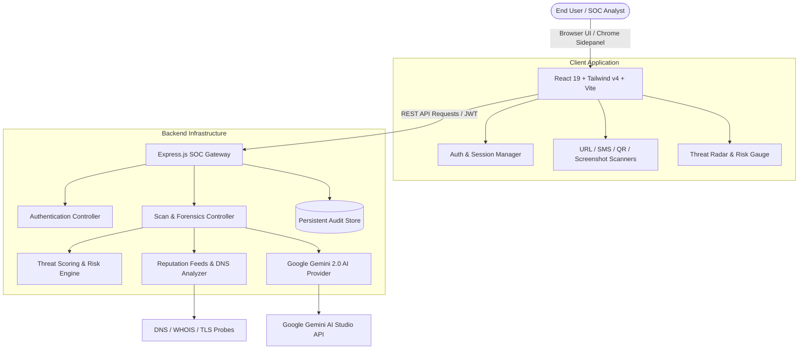

<div align="center">

# 🛡️ ThreatLens AI
### Next-Generation Multi-Vector Threat Intelligence & Explainable AI Security Operations

[](https://opensource.org/licenses/MIT)
[](https://www.typescriptlang.org/)
[](https://reactjs.org/)
[](https://tailwindcss.com/)
[](https://vitejs.dev/)
[](https://ai.google.dev/)
[](https://developer.chrome.com/docs/extensions/reference/sidePanel/)

<p align="center">
  <b>Detect Phishing • Block Quishing • Neutralize Smishing • Expose Visual Impersonation</b>
  <br />
  <i>Powered by Google Gemini 2.0 Flash, Deep Heuristics, and Real-Time Cryptographic Verification.</i>
</p>

[Key Capabilities](#-key-capabilities) •
[Architecture](#-system-architecture) •
[Quick Start](#-quick-start) •
[Chrome Extension](#-chrome-extension-manifest-v3) •
[API Documentation](#-api-endpoints) •
[Tech Stack](#-tech-stack)

---

</div>

## 📌 Overview

**ThreatLens AI** is a production-grade, multi-vector cybersecurity platform designed to protect individuals, security analysts, and enterprise SOC teams against sophisticated social engineering and cyber threats before damage occurs.

Traditional scanners rely on outdated blacklists or single-dimensional URL lookups. ThreatLens AI bridges this gap with a **Zero-Trust Multi-Engine Pipeline** that combines real-time DNS telemetry, cryptographic TLS verification, optical computer vision, and explainable neural reasoning powered by **Google Gemini AI**.

---

## ⚡ Key Capabilities

### 1. 🌐 Live URL & Phishing Inspector
- **Real-time DNS & WHOIS Telemetry:** Inspects domain registration age, nameserver anomalies, registrar risk profiles, and top-level domain (TLD) heuristics.
- **Cryptographic TLS Audit:** Validates certificate authorities (Let's Encrypt vs OV/EV), issuer anomalies, and short-lived certificate flags.
- **Levenshtein Typosquatting Engine:** Detects homograph attacks and brand impersonation (e.g., `paypal-secure-verify[.]com` vs `paypal.com`).
- **Spatial Threat Radar:** 6-axis spatial radar scoring Domain, DNS, SSL/TLS, Threat Intel, Routing, and AI Confidence.

### 2. 💬 SMS & Message Smishing Detector
- **Natural Language Behavioral Analysis:** Detects psychological manipulation vectors (artificial urgency, fear-based coercion, credential harvesting prompts).
- **Embedded URL Extraction:** Automatically extracts and pivots to deep URL analysis for all hyperlinks contained within the message.
- **Brand Mimicry Scoring:** Recognizes fake postal courier deliveries, bank suspension alerts, and IRS/tax scam patterns.

### 3. 📱 QR Code (Quishing) Analyzer
- **Payload Extraction:** High-speed client & server-side QR decoding via `jsQR`.
- **Redirect Chain Forensics:** Follows obscured redirect hops and shorteners (`bit.ly`, `tinyurl`) to their final destinations.
- **Malicious Payload Classification:** Flags deceptive credential portals, malicious APK direct-downloads, and Wi-Fi hijack payloads.

### 4. 📸 Screenshot & Visual Forensics
- **Visual Brand Impersonation:** Multimodal computer vision inspects webpage screenshots for cloned corporate logos, spoofed bank login portals, and counterfeit favicons.
- **Deceptive Layout Detection:** Identifies hidden iframe overlays, invisible submission forms, and obfuscated credential fields.
- **Optical OCR Extraction:** Reads embedded text and warning banners directly from images.

### 5. 🧠 Explainable AI (XAI) Scoring Engine
- Never gives an arbitrary score without justification.
- Outputs human-readable evidence cards: **Executive Summary**, **Why It's Dangerous**, **Technical Indicators (IOCs)**, and **Immediate Remediation Steps**.
- Categorizes risk from **SAFE (0-15)**, **LOW (16-39)**, **SUSPICIOUS (40-69)**, **HIGH (70-89)**, to **CRITICAL (90-100)**.

---

## 🏗️ System Architecture



---

## 🚀 Quick Start

### Prerequisites
- **Node.js**: v18.0.0 or higher
- **npm** or **bun**
- **Google Gemini API Key**: Obtain a free API key from [Google AI Studio](https://aistudio.google.com/)

### 1. Clone the Repository
```bash
git clone https://github.com/ShahArpanPratikkumar/Threatlens-ai.git
cd Threatlens-ai
```

### 2. Install Dependencies
```bash
npm install --legacy-peer-deps
```

### 3. Configure Environment Variables
Copy `.env.example` to `.env`:
```bash
cp .env.example .env
```
Edit `.env` and set your credentials:
```env
GEMINI_API_KEY="your_gemini_api_key_here"
JWT_SECRET="your_custom_jwt_secret_key_2026"
PORT=3000
```

### 4. Launch the Development Server
```bash
npm run dev
```
Open your browser and navigate to **`http://localhost:3000`**.

---

## 🛡️ Chrome Extension (Manifest V3)

ThreatLens AI includes a first-class **Manifest V3 Chrome Extension** utilizing Chrome's **Side Panel API**, providing instant security telemetry alongside any open tab.

### Features
- **Active Tab Inspection:** One-click automated URL, DNS, and reputation analysis of whatever website you are browsing.
- **Right-Click Context Menu:** Highlight any link or text and choose *"Inspect with ThreatLens AI"*.
- **Quick Scanners:** Access URL, QR, SMS, and Tab Screenshot capture tools directly in the side panel.
- **Cross-Platform Sync:** Scans performed in the extension seamlessly sync with your Web App Dashboard.

### Building & Installing the Extension
1. Build the extension package:
   ```bash
   npm run build:extension
   ```
2. Open Google Chrome and navigate to `chrome://extensions`.
3. Enable **Developer mode** (toggle switch in the top-right corner).
4. Click **Load unpacked** and select the `dist-extension` directory inside the project root.
5. Click the **ThreatLens AI** icon in your browser toolbar to open the Side Panel!

---

## 🔌 API Endpoints

| Method | Endpoint | Description | Auth Required |
|---|---|---|---|
| `POST` | `/api/auth/register` | Create a new user account | No |
| `POST` | `/api/auth/login` | Authenticate user and receive JWT | No |
| `GET` | `/api/auth/me` | Fetch authenticated profile details | Yes (Bearer JWT) |
| `POST` | `/api/scan/url` | Submit a target URL for multi-layer inspection | Optional (Anon 1-scan limit) |
| `POST` | `/api/scan/message` | Submit SMS or email message text for smishing analysis | Optional |
| `POST` | `/api/scan/qr` | Submit a decoded QR payload or base64 QR image | Optional |
| `POST` | `/api/scan/screenshot` | Upload screenshot image (base64) for optical brand forensics | Optional |
| `GET` | `/api/scans/history` | Retrieve user audit logs with filter & pagination | Yes (Bearer JWT) |

---

## 🛠️ Tech Stack

### Frontend
- **Framework:** React 19 (Hooks, Context API, Suspense)
- **Styling:** Tailwind CSS v4, Glassmorphism, CSS Cyber Aesthetics
- **Build Tool:** Vite 8.3
- **Animations:** Motion (`motion/react`)
- **Icons:** Lucide React
- **Data Visualization:** Recharts, SVG Spatial Threat Radar

### Backend
- **Runtime:** Node.js + Express.js (TypeScript via `tsx`)
- **AI Core:** `@google/genai` (Gemini 2.0 Flash)
- **Authentication:** JSON Web Tokens (`jsonwebtoken`) & `bcryptjs`
- **QR Decoding:** `jsQR`
- **Architecture:** Zero-Trust Modular Controller/Service Pattern

---

## 📁 Directory Structure

```text
Threatlens-ai/
├── extension/                 # Manifest V3 Chrome Extension source
│   ├── background/            # Service worker scripts
│   ├── content/               # Content scripts & DOM inspection
│   ├── popup/                 # Extension popup interface
│   └── sidepanel/             # Chrome Side Panel UI
├── public/                    # Static assets, branding, and extension zip
├── scripts/                   # Automation scripts (extension bundler, icon generator)
├── server/                    # Backend architecture
│   ├── config/                # Database & configuration
│   ├── controllers/           # Auth and scan endpoints
│   ├── middleware/            # JWT authentication & security headers
│   ├── routes/                # API router definitions
│   └── services/              # AI providers, QR, URL, SMS & Risk analyzers
├── src/                       # Frontend SPA (React + TypeScript)
│   ├── components/            # Reusable UI widgets & visualizers
│   ├── context/               # Auth, Theme, and Toast state providers
│   ├── pages/                 # Landing, Dashboard, Scanner & Auth pages
│   └── services/              # Client API SDK
├── index.html                 # HTML entrypoint
├── package.json               # Dependencies and build scripts
├── tsconfig.json              # TypeScript configuration
└── vite.config.ts             # Vite configuration
```

---

## 🔒 Security & Privacy Guarantee

- **Zero Credential Harvesting:** ThreatLens AI never logs, stores, or transmits passwords, banking credentials, or personal identity numbers entered during scanning.
- **Strict Content Security Policy:** Extension operates with zero remote script execution (`unsafe-eval` disabled).
- **Environment Isolation:** Secrets and API keys are strictly loaded via server-side environment variables and are never bundled into client-side assets.

---

## 🤝 Contributing

Contributions, bug reports, and feature proposals are welcome!
1. Fork the repository
2. Create your feature branch (`git checkout -b feature/ZeroDayDetector`)
3. Commit your changes (`git commit -m 'feat: add zero-day heuristic detection'`)
4. Push to the branch (`git push origin feature/ZeroDayDetector`)
5. Open a Pull Request

---

## 📜 License

Distributed under the **MIT License**. See `LICENSE` for more information.

---

<div align="center">

Built with ❤️ by **[ShahArpanPratikkumar](https://github.com/ShahArpanPratikkumar)**

⭐ **If you find ThreatLens AI useful, please consider giving this repository a star on GitHub!** ⭐

</div>
